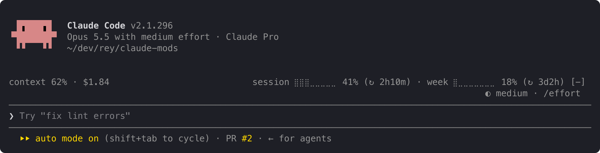
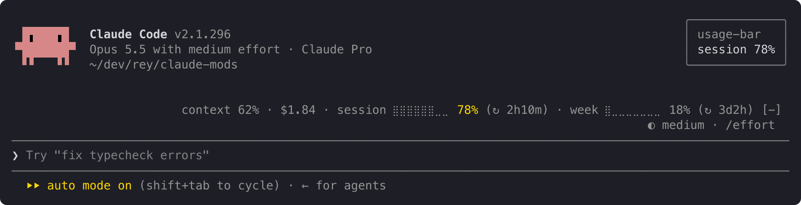
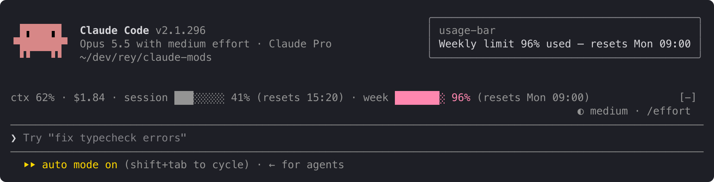

# usage-bar

Your plan's usage limits, context and cost on one quiet line above the prompt, with an alert before you run out. It doesn't replace your status line: it sits above the prompt, so the two work side by side.



The line sits at the right edge, away from where you read and type. First, this conversation:

- `context`: how full the context window is.
- `$`: what this session has cost.

Then your account's limits:

- `session` and `week`: how much of your 5-hour and weekly limits you've used, and after `↻`, how long until each resets: `2h10m`, `3d2h`, or `now` once it has reset.

## Alerts

A limit's percent turns yellow at 75% and red at 90%, as on claude.ai's usage page; the rest of the line stays grey. An alert with the limit and its percent appears at the top right at 50%, 75% and 90%:





When both limits cross at once, one alert names both: `session 62% · week 97%`. Each alert shows once per limit period, even across restarts and projects. When a limit resets, its alerts start over.

## When the line doesn't fit

The line at the top is the full layout. When it doesn't fit, it shortens instead of wrapping, one step at a time:

```
ctx 62% · $1.84 · s ⣿⣿⣿⣀⣀⣀⣀⣀ 41% (↻ 2h10m) · w ⣿⣀⣀⣀⣀⣀⣀⣀ 18% (↻ 3d2h)
```

```
ctx 62% · $1.84 · s 41% (↻ 2h10m) · w 18% (↻ 3d2h)
```

```
ctx 62% · $1.84 · s 41% · w 18%
```

## Before the first reading

For a few seconds after startup, and for as long as you're not logged in, the line reads:

```
usage: no data yet
```

The context shows `–` until your first reply, because Claude Code measures the context only when it answers.

## What it is not

- **Not a status line.** It sits above the prompt and leaves your status line alone.
- **Not a usage history.** It shows the current figures and nothing over time.

## Privacy

usage-bar reads only figures Claude Code already has: context fill, session cost and your plan's limits. It sends nothing anywhere and makes no network requests. It stores one small record per limit on your machine, listing the alerts already shown in the current period, so a restart doesn't repeat them.

## Install

In Claude Code:

```
/plugin install usage-bar --marketplace andrej-kolic/claude-mods
```

The desktop app's Code tab doesn't offer `/plugin install`: run it once in a terminal, at the user scope, and the line shows in the desktop app's local sessions too.

- **Claude Code:** 2.1.275 or later for this one-step install. Tested on 2.1.295 and 2.1.296 in the terminal, and in the desktop app 2.31226.0.
- **Plan:** usage limits need a Claude subscription. With an API key, the line shows only the context and `$`, and no alerts.
- **Context cost:** about 0 tokens. It adds nothing to what Claude reads.
- **Where it shows:** Claude Code's terminal and the desktop app's Code tab. It does nothing on claude.ai or in Cowork.

## More

The screenshots use sample readings. The yellow and red follow your Claude Code theme.

The [spec](https://github.com/andrej-kolic/claude-mods/blob/main/docs/usage-bar.md) has every rule: rounding, colours, widths, and when alerts repeat.
